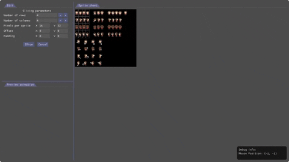

# Sprite sheet splitter
Preview settings for splitting sprite sheets and setup animations.

## Summary
I needed some tool to help me split irregular sprite sheets and setup animations quickly, in the process of making video games.
On the other hand, I wanted to experiment with integrating ImGui to a LÖVE2D project.

## Prerequisites
This software can run "as is", with the [LOVE-IMGUI](https://github.com/slages/love-imgui)(imgui module for LÖVE2D including lua bindings) being directly included in the src folder (ugly, I know).

## How to use
You can modify the "slicing parameters" until you are satisfied with your selection.
When clicking slice, the selected sprites / frames will be given a number.
You can then preview an animation by double clicking the frames in the desired order.
The interval between frames is given in seconds, and can be modified.
All these changes will be reflected on the fly.

